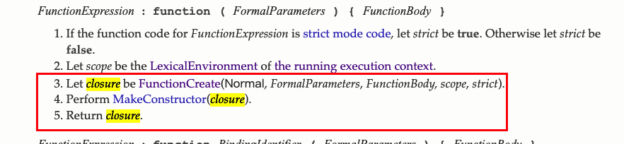
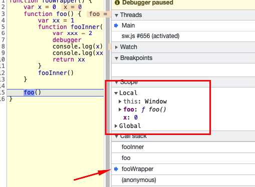
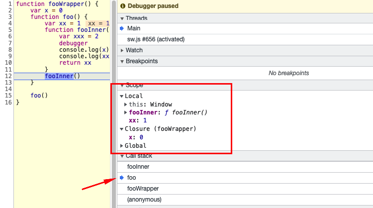
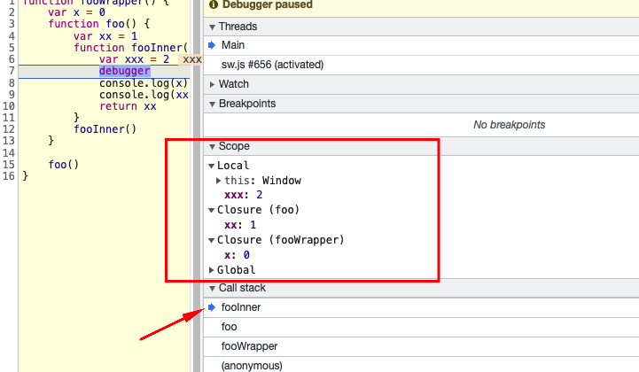

### 什么是闭包?怎么产生一个闭包

闭包是什么：来看下下面的一些定义

[MDN的定义](https://developer.mozilla.org/zh-CN/docs/Web/JavaScript/Closures)
> 一个函数和对其周围状态（lexical environment，词法环境）的引用捆绑在一起（或者说函数被引用包围），这样的组合就是闭包（closure）。也就是说，闭包让你可以在一个内层函数中访问到其外层函数的作用域。在 JavaScript 中，每当创建一个函数，闭包就会在函数创建的同时被创建出来。

**《JavaScript 高级程序设计(第3版)》**
> 闭包是指有权访问另一个函数作用域中的变量的函数。

**《JavaScript 权威指南(第6版)**
> 函数对象可以通过作用域链相互关联起来，函数体内部的变量都可以保存在函数作用域内，这种特性在计算机科学文献中称为闭包。

对于闭包的定义，都各有不同，而且理解起来有些生涩。在去陈述闭包是什么的时候这些定义都是可以的。把自己认为最正确的定义说出来，再通过**闭包的应用**的应用来解释自己的陈述

在查找资料过程中， 我简单翻看了es6的 `Function Definitions` 的定义  [链接地址](https://262.ecma-international.org/6.0/#sec-function-definitions)



可以看到其定义的`闭包Closure` 是内部 `FunctionCreate` 返回的

我来说下我对于闭包的理解------

首先： 闭包有两个部分：
1. 函数
2. 该函数所在词法环境的变量

- 定义上：一个函数的创建就形成了闭包
- 实际意义上： **闭包函数需要引用有所在词法环境变量** 函数引用了所在词法环境中的变量， 即使所在上下文环境，变量还存在

插入一下自己的想法：

1. 抛开`闭包`这个玩意，正常情况下，一个函数执行结束后，函数内部的变量也会随之销毁，但是实际情况中有诸多可能我们还需要用到这些本应销毁的变量，比如函数里返回一个函数（引用了外层函数变量），这个时候我们需要让这个变量实际存在，所以诞生了`闭包`。因为没法确定诸多可能，所以在函数创建的时候就让他形成了闭包
2. 函数执行是**栈**的结构， 执行时**入栈**， 执行结束**出栈**, 在函数执行时，他会携带`闭包`里被引用的变量，在执行栈中就可以引用这些变量

```js
function fooWrapper() {
	var x = 0
	function foo() {
		var xx = 1
		function fooInner() {
			var xxx = 2
			debugger
			console.log(x)
			console.log(xx)
			return xx
		}
		fooInner()
	}

	foo()
}
```
把上面的代码放在浏览器控制台中打开执行上面的代码：来看下调用栈及其包含的变量，




`fooWrapper` `foo` `fooInner` 依次入栈，栈中作用域的变量可以看到**local, global 还有所携带的闭包中的变量**

#### 闭包的应用
闭包的定义真的玄而又玄，对于深刻理解闭包，不如重点理解闭包的应用

**闭包的应用无处不在**

```js
function foo() {
	var a = 1

	return function () {
		a++
		console.log(a)
		return a
	}
}

var getA = foo()

getA() // 2

getA() // 3
```
上面的例子是不是我们很常见，自己在写代码中经常有这种情况，另外面试题中也会遇到

当然在面试中，还会这样
```js
var getA = foo()
getA() // 2
getA() // 3

var getB = foo()
getB() // 2
```
因为foo再次执行的时候，形成了新的闭包

这面的例子就是闭包最为基础的功能： 缓存数据，变量持久化，归根结底还是闭包内的变量是活跃的，可以一直引用这个变量

### 下面来闭包的具体应用

#### 通过闭包变量的缓存做不同的处理

1. 单列模式的应用

举个简单的例子
```js
// 确认是否恋爱了
function inLove() {
	// 只有你一个单身狗
	const persons = ['单身狗']

	function addPerson() {
		persons.push('单身狗')
	}

	return {
		addPerson,
		getRes: function () {
			return persons.length > 1
		}
	}
}

const love = inLove()
love.addPerson()
love.getRes()
love.addPerson()
love.getRes()
```
上面的例子： 如果一个人则是单身狗，如果又来了一个单身狗，代表你们是一对情侣，再来一个还是情侣。。。。

**单例模式**
class 内部一个属性instance 第一次实例化后，给到这个属性值，存在后则不在实例化 返回已经生成的实例
```js
class SingletonApple {
  constructor() {

  }
  static getInstance() {
    if(!this.instance) {
      this.instance = new SingletonApple();
    }
    return this.instance;
  }
}
```

#### 模拟块作用域
- 一道经典面试题
```js
for (var i = 0; i < 5; i++) {
  setTimeout(function() {
      console.log(i)
  }, i * 1000 )
}
```
依次打印出5个5

希望一次打印出每个i（0， 1， 2， 3， 4） 怎么改写呢

当然可以直接`let`

看下通过闭包的形式

```js
for (var i = 0; i < 5; i++) {
	(function(i) {
		setTimeout(function() {
				console.log(i)
		}, i * 1000)
	})(i)
}
```
**通过一个自执行函数(IFFE)** 传入我们的当前循环的i 就可以了

首先在未改写前，我们的setTimeout延迟执行，循环体正常执行，循环完成后，setTimeout才会执行，这时候i是全局变量， 已经被是循环后的值5， 所以用let是可以的， 通过闭包呢，我们**形成自己的作用域**, i 被当做参数 传入， 这里的i是当前循环的i值

扩展一下 我们可以对节点循环进行事件绑定
> 获取一组dom节点 循环对他绑定一个函数 函数内需要用到变量i 也是通过这种方法

#### 函数柯里化
- 函数柯里化是指将接受 n 个参数的 1 个函数改为只接受一个参数的 n 个互相嵌套的函数
先偷一个例子看下
```js
function getAddress(province, city, area) {
	  return province + city + area
}
getAddress('江苏', '无锡', '滨湖区')
```
根据柯里化定义 改写下
```js
function getAddress(province) {
	return function (city) {
		return function(area) {
			return province + city + area
		}
	}
}

getAddress('江苏')('无锡')('滨湖区')
```
体验下其好处
```js
var province = getAddress('江苏')
var wuxi = province('无锡')
// 这个时候我想获取南京
var city = province('南京')
var area = city('玄武区')
```
此时闭包的用起来是不是有点感觉了

#### 偏函数
- 偏函数其实是柯里化的升级，他没有柯里化对于1个参数限制，根据实际情况 n个参数可以随意每次传入多个参数

下面来看下一道经典的面试题

```js
实现下面的方法

add(1)(2)(3) = 6;

add(1, 2, 3)(4) = 10;

add(1)(2)(3)(4)(5) = 15;
```
```js
function add() {
	var arg = [... arguments]

	var calc = function () {
		var newArg = [... arguments]
		if (newArg.length) {
			arg.push(...newArg)
			return calc
		} else {
			return arg.reduce((cur, next) => cur + next, 0)
		}
	}

	return calc
}

add(1)(2)(3, 4)() // 10
```

如果写一个柯里化函数呢
```js
function currying(fn, length) {
  length = length || fn.length
  return function (...args) {
    return args.length >= length
        ? fn.apply(this, args)
      : currying(fn.bind(this, ...args), length - args.length)
  }
}
```
#### 模块化的应用

es6的module中就运用到了闭包 [查看链接](https://tc39.es/ecma262/#sec-execute-async-module)

给个简单的列子
```js
function createModule() {
	var x = 1,
	y = 2
	z = 3

	return {
		x,
		y,
		z,
		add(fish) {
			return x + y + z + fish
		}
	}
}

exportModule = createModule()

exportModule.x
exportModule.y
exportModule.add('咸鱼')
```
对于`webpack`这些打包工具都是基于闭包的形式

### 关于闭包造成内存泄漏的问题
滥用闭包，会造成闭包变量没法被垃圾回收机制回收掉。
一般情况使用闭包不过出现内存泄漏，当嵌套过多的时候，层层的闭包变量都是活跃变量，就可能出现内存泄漏

关于闭包的回收机制，可以看下[司徒正美的一篇文章](https://www.cnblogs.com/rubylouvre/p/3345294.html) 分析了各个浏览器不同引擎的处理 -- **故人已去白鹿永存**


### 总结
感觉 闭包 是 应运而生的一个东西，它无处不在， 基于它衍生出来很多应用和写代码的手段，基于闭包的认知，学习这些衍生出来的更关键。


